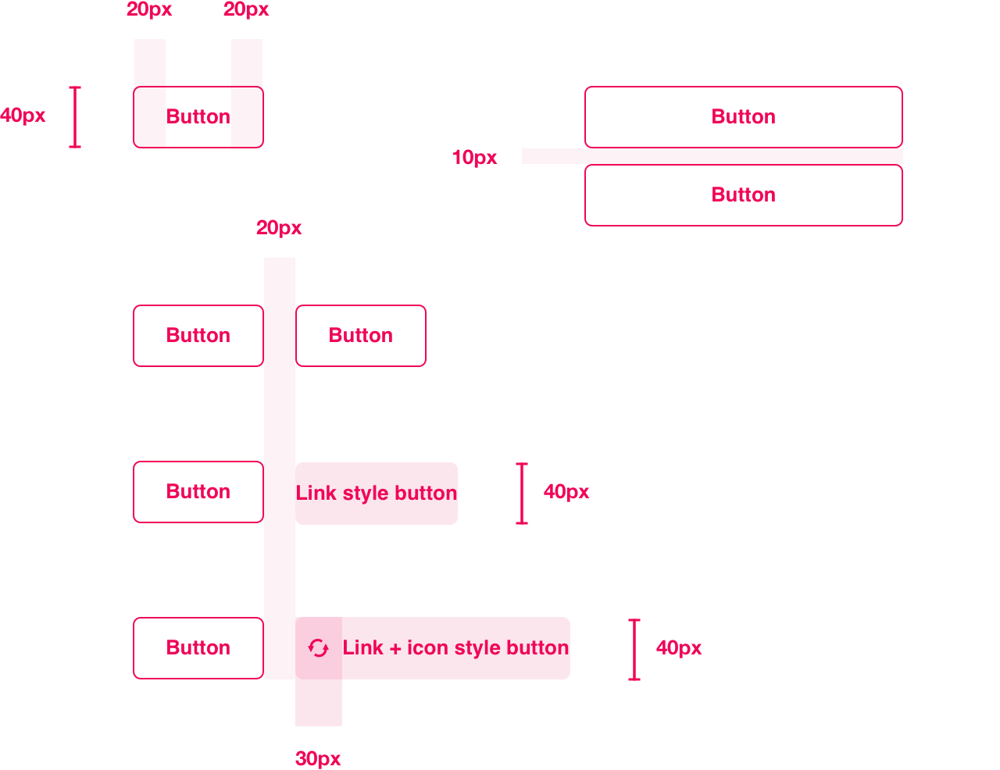

# Buttons

Please refer to the Digital Foundations documentation for guidelines on [call to actions ↗](https://digital-foundations.netlify.com/cta/). In addition to those guidelines, the following also apply to buttons in the Plasma system:

### General guidelines

* Text on buttons should always use the [Bold 5](/text-styles/#bold-5) text style.
* Text on active buttons is always `$black50` color.
* Button height is 38px (40px including top/bottom border of 1px).
* No icons on primary, secondary or tertiary style buttons.
* Icons can be used in link style buttons, where applicable.

### Spacing guidelines

* Buttons have left/right padding of 20px (except for link buttons, which have no padding).
* Buttons contained in narrow spaces (e.g. filters) should fill 100% of the width available to them. This helps with cleaner alignment with other elements in that column, and also aligns multiple buttons when stacked.
* If multiple buttons are horizontally aligned, there should be a 20px margin separating them.
* If multiple buttons are stacked vertically, there should be a 10px margin separating them.

### Animation

* There is a subtle fade transition from normal to hover state on buttons.
* `transition: all 0.2s;`
* Loading animation (spinner icon) on buttons found [here ↗](https://projects.lukehaas.me/css-loaders/)

### Disabled state

* All button styles follow the same disabled state:
* No background color (opaque fill).
* All colors including text, border and any icon are `$black` or `$white`
* Disabled button has an opacity of 10%.

### Preview of button types

See next: [Button types](/button-specs/README.md)
