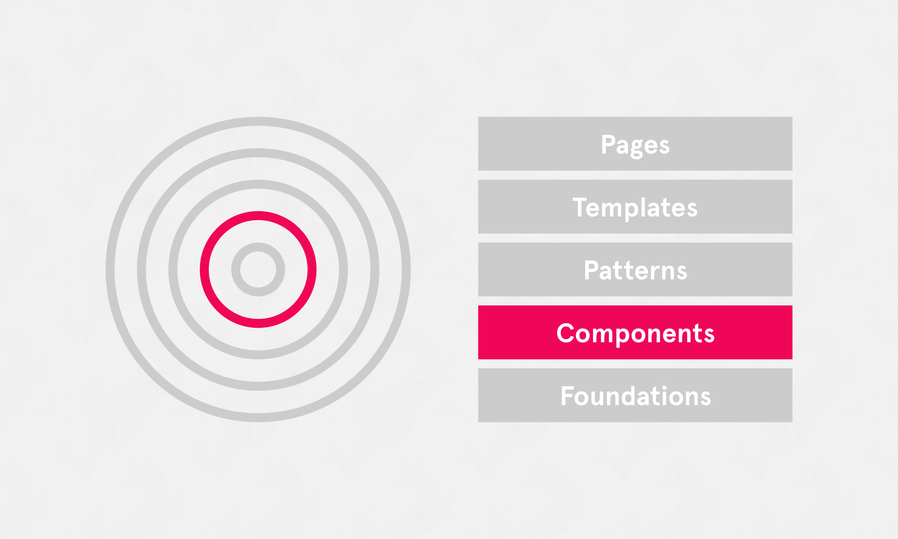

# Components

Referring to distinctive UI elements that are used over and over throughout the UI. A few examples include buttons, form inputs, toggles and tooltips. Another way of looking at it: A component is a UI element that you could 'drag & drop' into an artboard/canvas to make up the UI. Consistent UI components make a huge difference in guiding a user through a product, smoothly and efficiently.

Everything documented here is an extension of, and in addition to the '[Digital Foundations ↗](https://digital-foundations.netlify.com)' documentation that covers all our digital products.

### Skip to

* [Form elements](/form-elements/README.md)
* [Types of form imputs](/form-specs/README.md)
* [Buttons](/buttons/README.md)
* [Types of buttons](/button-specs/README.md)
* [Tooltips](/tooltips/README.md)
* [Toggles](/toggles/README.md)
* [Tabs](/tabs/README.md)
* [Pagination](/pagination/README.md)
