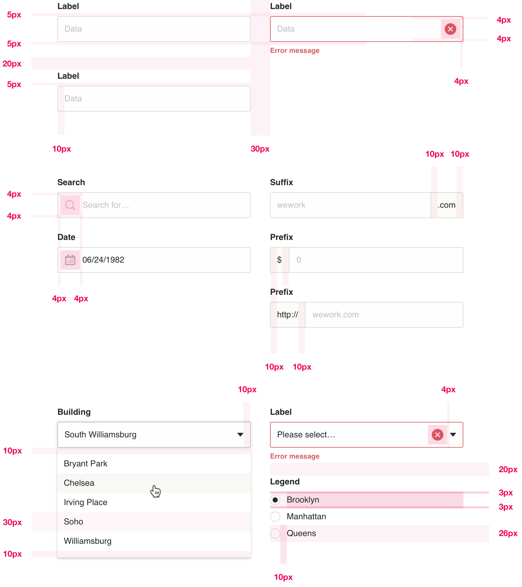

# Forms

Please refer to the Digital Foundations document for guidelines for [accessibility ↗](https://digital-foundations.netlify.com/accessibility/) information relating to form fields, including '[form fields with labels ↗](https://digital-foundations.netlify.com/accessibility/#form-fields-with-label)' and '[placeholder text ↗](https://digital-foundations.netlify.com/accessibility/#placeholder-text)'. In addition to those guidelines, the following also apply to form elements in Plasma:

### General guidelines

* All inputs have a 2px border-radius.
* All inputs have a ‘normal’ border color of `$gray40`.
* All inputs have a ‘hover’ border color of `$gray50`.
* Placeholder text is always `$gray50` color.
* Normal / filled out text is always `$black50` color.
* Text on regular inputs (or labels for checkboxes and radio buttons) use the [Regular 2](/text-styles/README.md#regular-2) text style.
* Text input, textarea and select height is 38px (40px including 1px border).
* Form labels use the [Bold 5](/text-styles/README.md#bold-5) text style.
* Text input, textarea and select have 10px left/right padding.

### Spacing guidelines

* Text input, textarea and select have left/right padding of 10px.
* Text inputs, textareas and selects should fill 100% of the width available to them (i.e. their containing element, be it the filters column or a segmented card).
* Form elements displayed horizontally should have a 30px margin separating them.
* Form elements stacked vertically should have a 20px margin separating them.
* Form elements should have a 5px margin between label and input.

### Focus state

* As per our foundational [focus state guidelines ↗](https://digital-foundations.netlify.com/accessibility/#focus-states), inputs in Plasma have an outer glow (box-shadow) to clearly distinguish that element from other UI.
* The border color of the input is the same as the hover state of that input.

### Disabled state

* The input border and any icons are all `$gray30` color when that element is disabled.
* The label and placeholder text are all `$gray40` color when the input is disabled.

### Hint text

An optional instruction can been included under each input. A simple line of text below an input for special instruction (e.g. “Required for security purposes”, or “Password must be over 8 characters”).

* Hint text should use the [Regular 3](/text-styles/README.md#regular-3) style.
* Text should be `$gray50` color (to match placeholder text).
* 5px margin separating instruction text from input above it.

### Error state

Errors should always be explained — it’s not enough to flag an error (via a color change or warning icon). An error message should be displayed inline (below) with the source of the error, explaining what went wrong (e.g. ‘Username required’, or ‘The character limit is 140’).

* Error text should use the [Bold 6](/text-styles/README.md#bold-6) style (bold is used to emphasize the error).
* The text in input and label should retain their original color (no change).
* 5px margin separating error text from input above it.
* The `$red50` color is used for communicating errors and warnings.
* An additional icon is included in text inputs, textareas and selects in the `$red50` color positioned to the right of that input (this icon is included in the UI Kit).

### Basic specification for inputs

