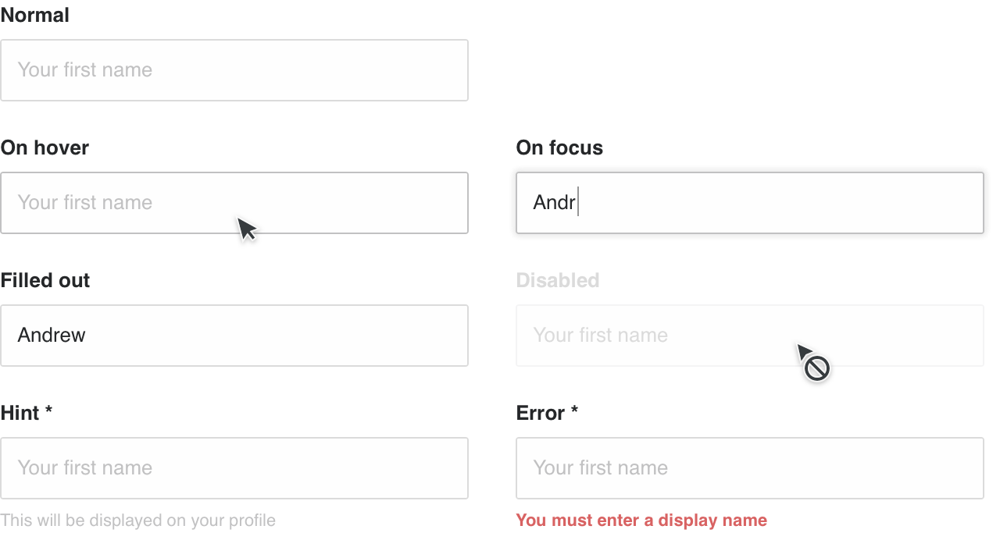
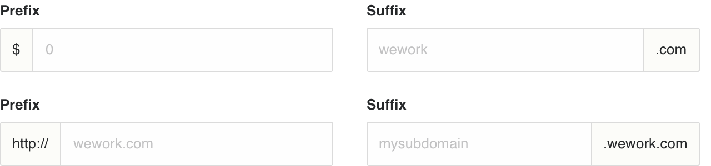
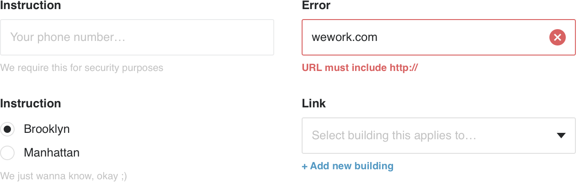
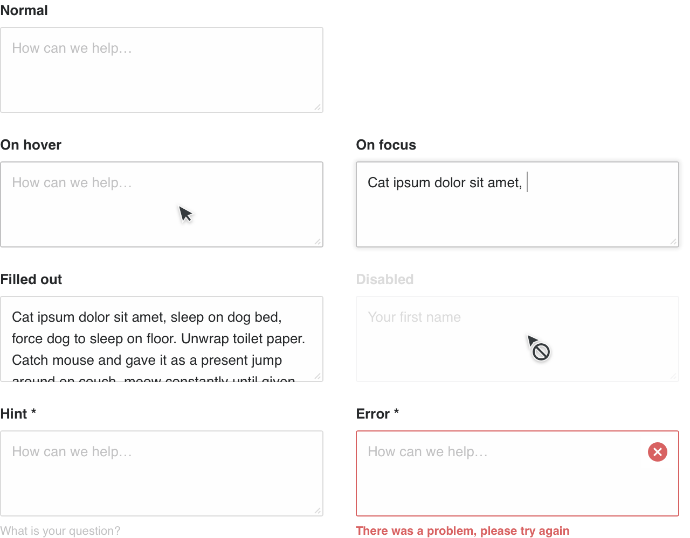
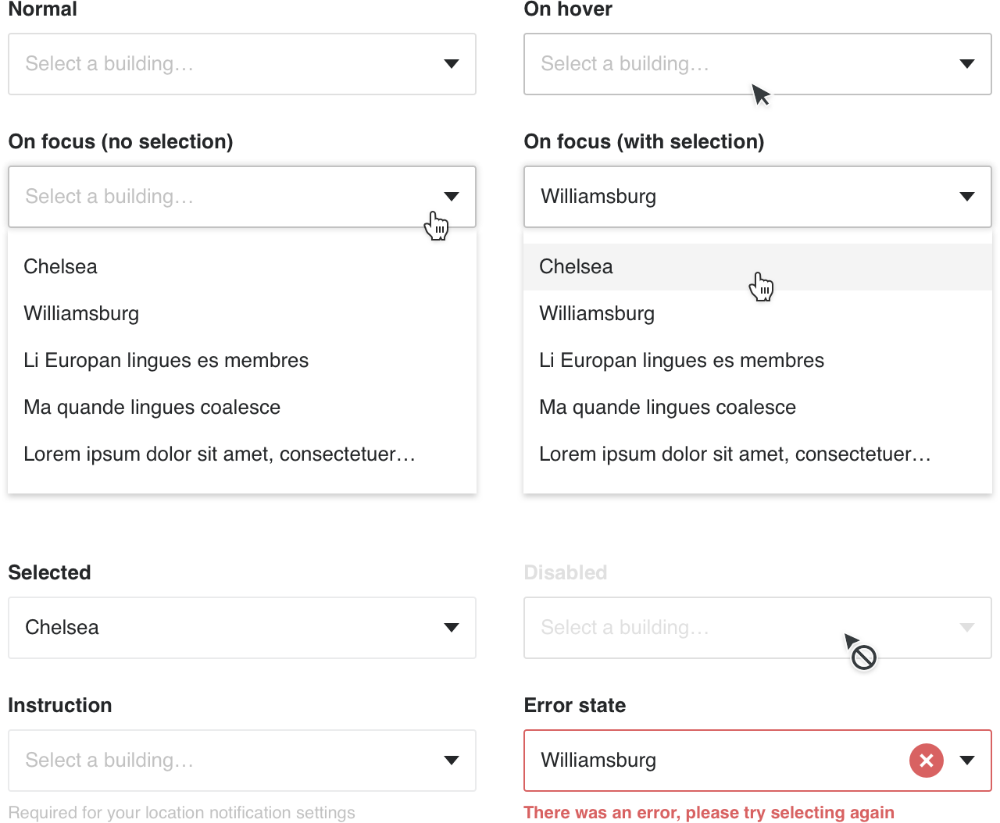
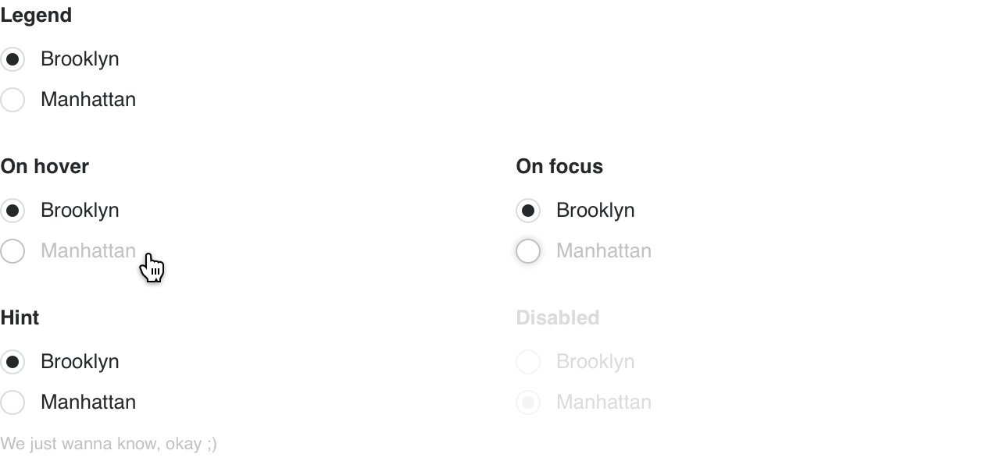
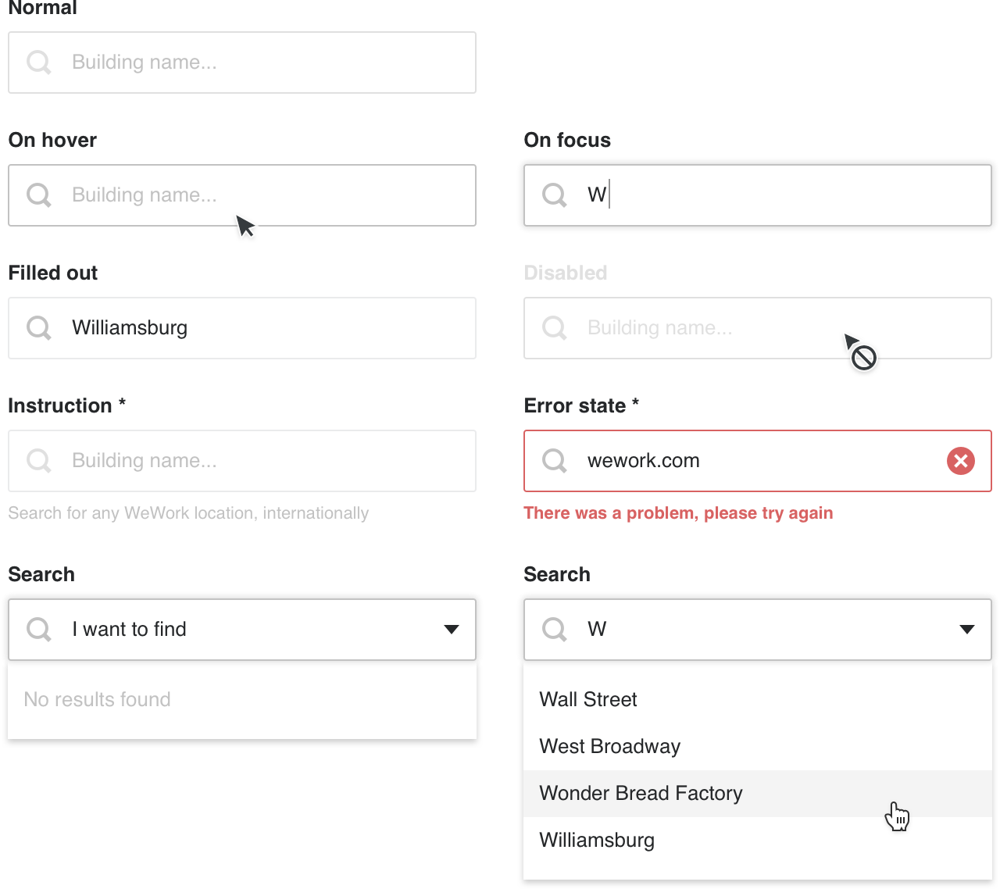
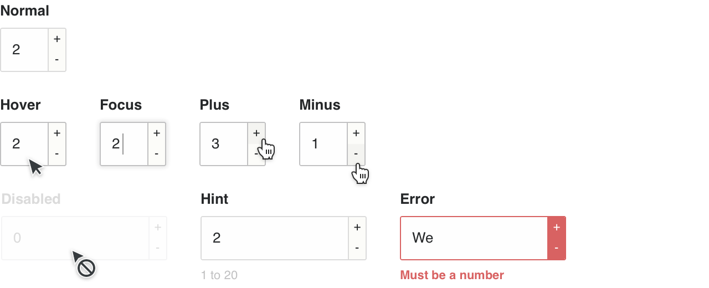
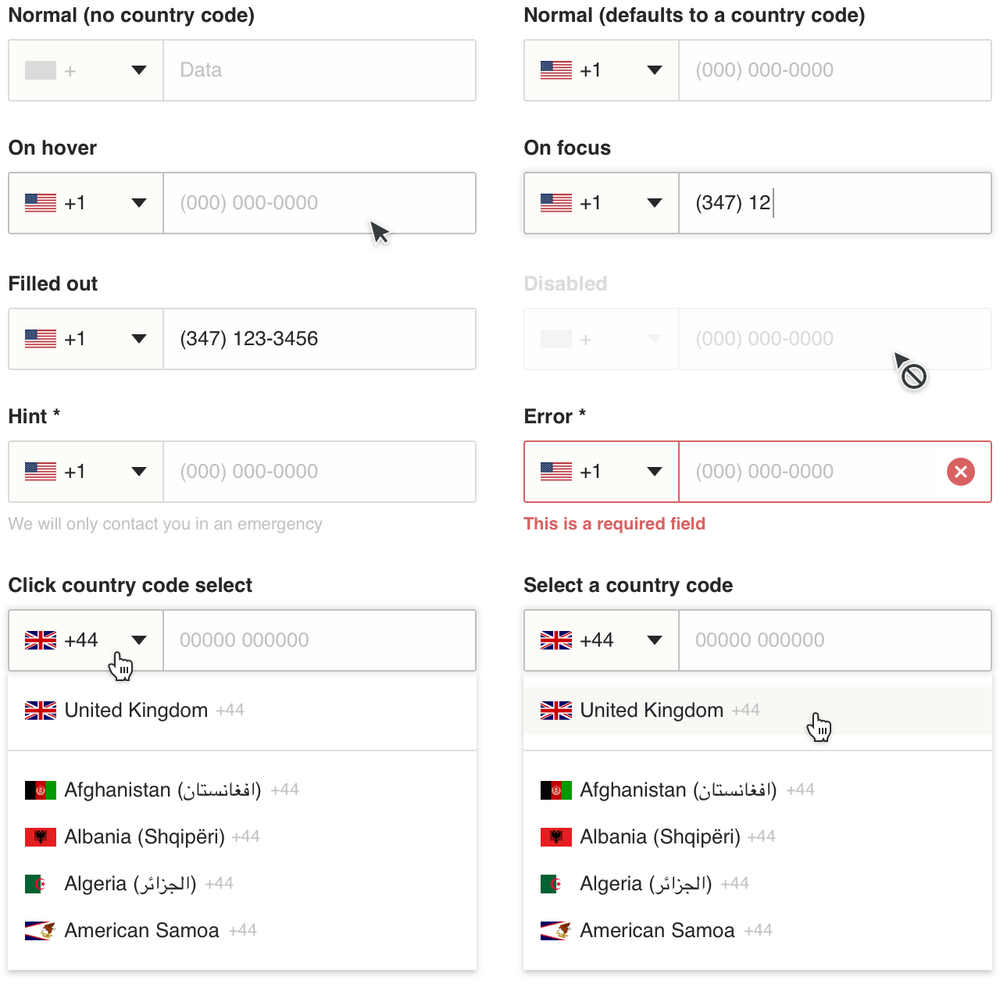
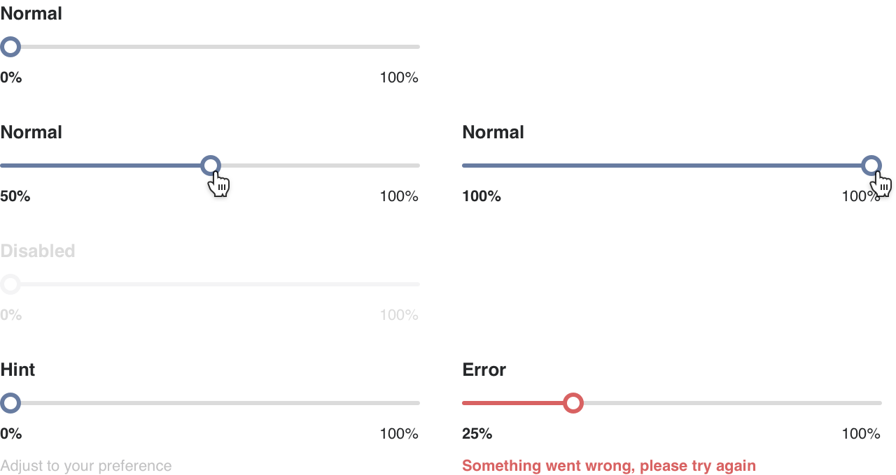

# Input types

Below are specs for all the form input types. Each input has up to 7 states, including: placeholder, hover, focus, filled out/selected, disabled, instruction (hint) and error.

Note: All CSS shown is for guiding purposes, it's not absolute. It's intended to help designers foster a greater understanding of both CSS and the specifications.

---

## Label & legend

* Labels are used above all text inputs, textareas and selects. Legends are used (similarly to, or as a label) in [fieldsets ↗](https://www.w3schools.com/tags/tag_fieldset.asp), above a group of checkboxes or radio buttons.
* For elements that are a required field, the label or legend should include an asterisk `*` after the label/legend, separated by a space (e.g. `First name *`).

<span class="image-spec spec-typo"></span>

```
/* Label & legend */
font-family: Helvetica;
font-weight: bold;
font-size: 13px;
margin-bottom: 5px;
```

---

## Inline label

Special use case alternative to positioning a label above an input or select. Useful for layouts that need to conserve vertical space.

<span class="image-spec spec-typo"></span>

```
/* Inline label */
font-family: Helvetica;
font-weight: bold;
font-size: 13px;
line-height: 40px;
margin-right: 20px;
```

---

## Text input

Used for simple text or number fields. Variants include an email, number or password inputs, which all use the same text input style.

<span class="image-spec spec-typo"></span>

```
/* Text input */
background-color: $white;
height: 38px;
padding: 0 10px;
border: 1px solid $gray40;
border-radius: 2px;
font-family: Helvetica;
font-weight: regular;
font-size: 13px;
color: $black50;

/* Placeholder */
color: $gray50;

/* Hover */
border-color: $gray50;

/* Focus */
border-color: $gray50;
box-shadow: 0 0 4px 1px $gray40;

/* Disabled */
color: $gray40;
cursor: not-allowed;

/* Error (input) */
border-color: $red50;
```

See also: [Hint text / Field caption](#hint-text--field-caption)

---

## Prefix & suffix

Useful to add extra clarity as to what is expected of a text input.

<span class="image-spec spec-typo"></span>

```
/* Prefix/suffix */
padding: 0 10px;
font-family: Helvetica;
font-weight: regular;
font-size: 13px;
color: $black50;
background-color: $bg1;
border-color: $gray40;
```

---

## Hint text / Field caption

An optional hint (text) below a form field or fieldset, with three use cases:

* Instruction: Provide more context to what the form field is asking.
* Error: Why is this form field showing an error.
* Link: A link or action related to the form field.

<span class="image-spec spec-typo"></span>

```
/* Hint text */
font-family: Helvetica;
font-weight: regular;
font-size: 11px;
color: $gray50;
margin-top : 5px;

/* Error hint text */
font-weight: bold;
color: $red50;

/* Link/action text */
font-weight: bold;
color: $blue50;

/* Disabled state */
color: $gray40;
```

---

## Textarea

* Used when at least a sentence of text is expected or necessary to be entered.
* Consider setting a minimum 4 rows. This increases the height of the textarea (to roughly 100px), making it clearer to the user that they can write more.
* When the expectation is for the user to write significantly more, consider setting the the number of rows to 10(+) so they know they can write more, and there’s less vertical scroll for them as they type.

<span class="image-spec spec-typo"></span>

```
/* Textarea CSS largely the same as a text input, with the below differences */

/* Textarea */
height: none;
padding: 10px;
```

---

## Select

* Used when there are multiple choices, but only one option can be selected.
* Consider using [radio buttons](#radio-buttons), as opposed to a select if there are only a couple/few options, or a simple either/or choice.
* A select also uses less space than a group of radio buttons — something to consider if your form is long, or space is limited.

<span class="image-spec spec-typo"></span>

```
/* Select CSS largely the same as a text input, plus the arrow */
```

---

## Options & option groups

Options are the ‘dropdown’ that appears below a [select](#select) on-click/focus. `<optgroup>` ([learn more ↗](https://www.w3schools.com/tags/tag_optgroup.asp)) inserts a non-selectable title above an option(s). This is useful if you need to separate groups of options for clarity.

<span class="image-spec spec-typo"></span>

```
/* Options */
background: $white;
padding: 10px 0;
font-family: Helvetica;
font-weight: regular;
font-size: 13px;
line-height: 30px;
color: $black50;
box-shadow: 0 2px 4px 0 rgba($black50,0.2);

/* Hover (an option) */
background-color: rgba($black50, 0.05);

/* <optgroup> */
font-family: Helvetica;
font-weight: bold;
font-size: 13px;
line-height: 30px;
```

---

## Multi-select and option tags

* Used when there are multiple choices, and more than one option can be selected.
* Selecting an option adds a ‘tag’ for that option, which can be removed by clicking the ‘x’ icon on the tag. More options/tags can be added.
* A maximum number of options can optionally be set.

<span class="image-spec spec-typo"></span>

```
/* Multi-select CSS largely the same as a select, with the below differences */

/* Multi-select */
padding: 3px 0;

/* Option tag */
height: 32px;
padding: 0 30px 0 10px;
border-radius: 2px;
margin-left: 3px;
background-color: $purple20;
font-family: Helvetica;
font-weight: regular;
font-size: 13px;
color: $white;
```

---

## Radio buttons

* Used when there are multiple choices, but only one option can be selected.
* Radio buttons are ideal for simple either/or choices, or when there are only a couple/few choices.
* Consider using a [select](#select) if there are more than a few choices — something to consider if your form is long, or space is limited.
* Radio buttons are preferable over a select when it’s important that the user sees the options available to them, to understand and consider, versus a more passive scan of their options via a select.
* A radio button can never be used singularly (e.g. for a yes/no or opt-in/out data capture), as it can only be selected, not un-selected. A minimum of two options must be presented to use radio buttons. Use a [checkbox](#checkbox) if there is only one option.

<span class="image-spec spec-typo"></span>

```
/* Input & label */
margin: 3px 0;

/* Input */
width: 16px;
height: 16px;
border-radius: 100%;
background: $white;
border: 1px solid $gray40;

/* Label (normal) */
margin-left: 10px;
font-family: Helvetica;
font-weight: regular;
font-size: 13px;
line-height: 20px;
color: $black50;

/* Checked (dot) */
height: 8px;
width: 8px;
border-radius: 100%;
background-color: $black50;
top: 3px;
left: 3px;
transition: background 0.2s linear;

/* Hover (input) */
border-color: $gray50;

/* Hover (label) */
opacity: 0.7;

/* Focus (input) */
border-color: $gray50;
box-shadow: 0 0 4px 1px $gray40;

/* Focus (label) */
opacity: 0.4;

/* Error (input) */
border-color: $red50;
```

---

## Checkboxes

* Used when there are multiple choices, and more than one option can be selected.
* Consider using a multi-select if there are several(+) choices — something to consider if your form is long, or space is limited.
* Checkboxes are preferable over a [multi-select](#multi-select-and-option-tags) when it’s important that the user sees the options available to them, to understand and consider, versus a more passive scan of their options via a multi-select.

<span class="image-spec spec-typo"></span>

```
/* Checkbox CSS largely the same as a radio button, with the below differences */

/* Input */
width: 16px;
height: 16px;
border-radius: 2px;
```

---

## Search (input or select)

A search field can be a [text input](#text-input) or a [select](#select) — use whichever is most appropriate for the scenario. The styles are the same as an input or select, the only difference being the inclusion of a search icon before the text.

<span class="image-spec spec-typo"></span>

```
/* Search CSS largely the same as a text input or select, with the below differences */

/* Search */
text-indent: 38px;

/* Search icon (normal) */
color: $gray40;
width: 30px;
height: 30px;
margin: 4px;

/* Search icon (hover) */
color: $gray50;
```

---

## Number input

Used when a number is the only thing required of an input.

<span class="image-spec spec-typo"></span>

```
/* Number input CSS largely the same as a text input, with the below differences */

/* Number input */
min-width: 60px;

/* Plus/minus control (normal) */
width: 15px;
background-color: $bg1;
border: 1px solid darken($bg1, 10%);

/* Plus/minus (active) */
background-color: darken($bg1, 10%);

/* Plus/minus control (disabled) */
border-color: $gray40;
background-color: $white;
color: $gray40;

/* Plus/minus control (error) */
border-color: $red50;
background: $red50;
color: $white;
```

---

## Date input

Used when a date is required to be entered. On-click of input launches a React date picker to select specific dates from a calendar UI.

<span class="image-spec spec-typo"></span>

```
/* Date input CSS largely the same as a text input, with the below differences */

/* Date input */
text-indent: 38px;

/* Icon */
color: $gray40;
width: 30px;
height: 30px;
margin: 4px;

/* Icon (hover) */
color: $gray50;
```

---

## Phone number input (and select)

Prefixes a text input with a select to choose from a list of country codes.

* Defaults to a placeholder flag (`$gray50` flag and “+”)
* First country code in options (dropdown) is the country you are currently in.
* Selecting a country auto populates formatting of placeholder text (e.g. (000) 000-0000 for the United States).
* Auto-formatting of a number as you type `e.g. 0000000000 becomes (000) 000-0000`
* Prefix select has min-width of 100px.
* Flag icons code at: https://github.com/lipis/flag-icon-css

<span class="image-spec"></span>

See also: [Text input](#text-input), [Select](#select) and [Prefix](#prefix-suffix)

---

## Range input (slider)

* A range input is useful to illustrate/communicate a sliding scale of an option.
* Use sparingly… A [text input](#text-input) is arguably more appropriate for quickly typing a value. Interacting with a range slider requires more ‘work’ from the user, but does help them to understand the min-max range of an option.

<span class="image-spec spec-typo"></span>

```
/* Slider bar */
height: 3px;
border-radius: 100%;
background-color: $gray40;
margin: 7px 0 12px 0;

/* Slider */
width: 9px;
height: 9px;
border: 3px solid $purple20;
border-radius: 100%;
background-color: $white;

/* Values */
font-family: Helvetica;
font-weight: regular;
font-size: 11px;
line-height: 18px;
color: $gray50;
```
