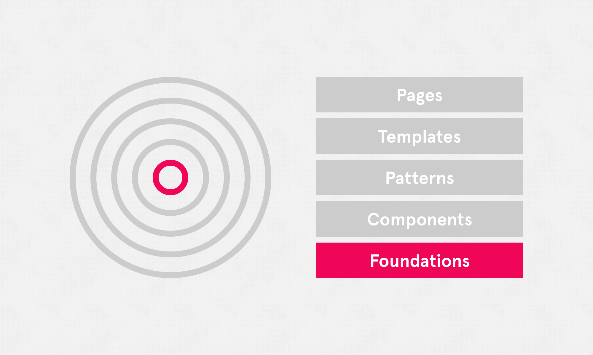

# Foundations

Foundations are essentially 'digital brand guidelines' for the products using this design system. They are styles and guidelines that touch all '[components](/components/README.md)' and '[patterns](/patterns/README.md)', forming the foundations of a product's UI. Examples include color, text styles, links, icons, and even spacing.

These guidelines relate only to the Plasma design system, designed for WeWork’s internal business tools. Everything documented here is an extension of, and in addition to the [Digital Foundations ↗](https://digital-foundations.netlify.com) documentation that covers all our digital products.

For more on what we define as ‘foundations’, [see here ↗](https://digital-foundations.netlify.com/system-design/).

### Skip to

* [Colors](/colors/README.md)
* [Typography](/typography/README.md)
* [Text styles](/text-styles/README.md)
* [Links](/links/README.md)
* [Formatting](/formatting/README.md)
* [Layout & spacing](/layout-spacing/README.md)
* [Responsive](/responsive/README.md)
