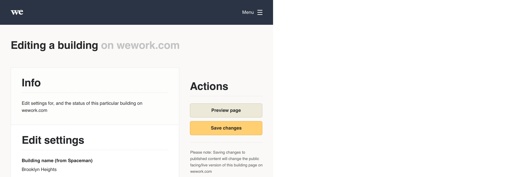

# Responsive

Please refer to the [responsive section ↗](https://digital-foundations.netlify.com/responsive-design/) of the digital foundations document for an introduction to designing responsively.

While our internal business tools are predominantly used on desktop/laptop computers, some roles at our locations require our employees to be on the move, so our products responding well on at least a tablet in landscape orientation makes sense. But why stop there. We know some employees, like members benefit from our products on apps. So rather than be forced to build apps for our tools, why not design a responsive system.

## The future

In the short run, at least, the products using Plasma are responsive down to tablet landscape size. But **the Plasma design system is designed to be fully responsive**. Included below are example product mockups to show the potential for responsive design, using Plasma.

### 1440px browser width

We know the majority of our team using our internal business tools are on at least a MacBook Air, so we use 1440px artboards as a ‘base’ for our designs, or the optimal size to design for. See below example:

### 1024px browser width (tablet landscape)

It is possible some team members in our buildings may use tablets to access our tools. On a tablet in landscape orientation, elements like the segmented card respond to an alternative layout (stack in this case) to make better use of the space. See below example:

### 768px browser width (tablet portrait)

On a tablet in portrait orientation the left navigation bar is no longer an efficient use of the limited screen width, so we switch to a horizontal navigation bar with a hamburger icon to open the navigation menu items. We also trim padding where appropriate, like going from 40px to 30px padding on the segmented card as seen below.

### 320px browser width (mobile)

On mobile our side column is no longer possible. In this case we take the vital ‘save button’ element from that column and include it as a fixed (on scroll) element at the foot of the screen on mobile. And the segmented cards now has no margin, and a reduced padding of 5% to make better use of the space. See below example:

