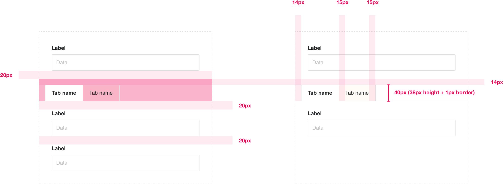

# Tabs

Sometimes needs arise where it’s helpful to group different types of content in a limited space (e.g. form elements into different tabs within a modal). This can help the user experience, and it can also be used to conserve space, or a pattern’s height and complexity.

<span class="image-spec"></span>

## Tabs

* Tabs can be used first in order, above all form elements, or used above/below form elements to further divide content.
* The tab element is a total of 54px in height, which includes a top and left padding of 14px. While this number sounds ‘obscure’, it is 14px so that the tab title aligns with the form labels below and/or above the tabs.
* You can use multiple tabs to divide/group content, or use one singular tab as a ‘sub-title’ for form elements below.
* Each tab has left/right padding of 15px.

<span class="image-spec spec-typo"></span>

```
/* Tabs */
padding: 14px 0 0 14px; /* so first tab aligns with labels */
border-bottom: 1px solid $gray40;

/* Tab */
height: 38px;
padding: 0 15px;
font-family: Helvetica;
font-weight: regular;
font-size: 13px;
line-height: 38px
color: $black50;
background-color: $bg1;
border: 1px solid $gray40;
border-radius: 2px 2px 0 0; /* first tab */
border-radius: 0; /* middle tab(s) */
border-radius: 0 2px 0 0; /* last tab */

/* Active tab */
background-color: $white;
border-bottom: 1px solid $white;

/* Hover (non-active tab) */
background-color: $bg3;
```

Note: All CSS shown is for guiding purposes, it's not absolute. It's intended to help designers foster a greater understanding of both CSS and the specifications.

### Tabs specifications

<span class="image-spec"></span>
