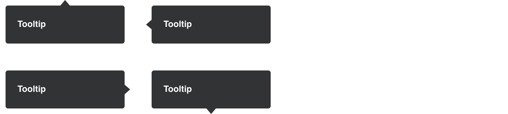

# Tooltips

Tooltips can be attached to any element. When you hover the element with your mouse, the title attribute is displayed in a little box next to the element, just like a native tooltip, only it can be styled as below. Tooltips are useful for things like form elements and tables, to show additional or helpful information.

<span class="image-spec spec-typo"></span>

```
/* Tooltip */
background-color: rgba($black50,0.94);
padding: 15px;
min-width: 150px;
font-family: Helvetica;
font-weight: bold;
font-size: 11px;
line-height: 18px;
color: $white;
border-radius: 3px;
text-align: left;
```

Note: All CSS shown is for guiding purposes, it's not absolute. It's intended to help designers foster a greater understanding of both CSS and the specifications.
